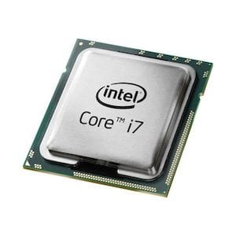
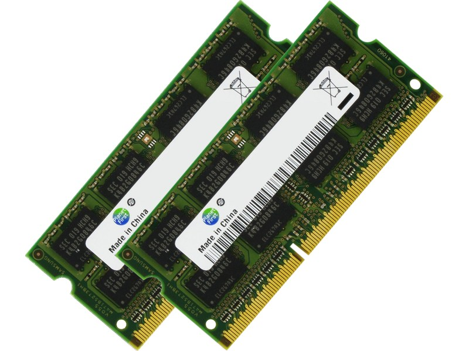

# 1 Les composants informatiques - C1

## Le processeur

Le processeur appelé aussi avec son terme anglais `CPU` (Central Processing Unit) que l'on pourrait traduire par "unité centrale de traitement".

Son rôle est central dans le fonctionnement d'un ordinateur, il s'occupe de tous les calculs qui sont nécessaires au bon déroulement d'une tâche,  que ce soit l'affichage d'une image, un calcul de taux de TVA, la lecture d'une vidéo, etc …

Il n'a qu'une seule et unique fonction, il ne fait que des opérations mathématiques. D'ailleurs on peut évaluer la puissance d'un processeur au nombre d'opérations qu'il peut effectuer à la seconde. L'unité de mesure est le GHz (Giga Hertz).

[Giga](https://fr.wikipedia.org/wiki/Giga) pour Milliard et [Hertz](https://fr.wikipedia.org/wiki/Hertz) pour le nombre de répétitions à la seconde.

Dans l'informatiques grand publique on évalue donc la puissance d'un processeur au nombre de milliards d'opérations qu'il peut effectuer à la seconde.

Par exemple le processeur ci-dessus en photo est le "Intel CoreI7" cadencé à 3,6 GHz (3 milliards 600 millions d'opérations à la seconde).

Il existe plusieurs type de processeurs, en fonction des usages. Dans l'informatique grand publique, on peut distinguer 2 grands types de processeurs : 

* `X86` / `AMD64` : le processeur des ordinateurs de bureau et laptop (ordinateurs portables)
* `ARM` : le processeur des appareils mobiles (téléphones mobiles, tablettes, etc…)

Ce qui va notamment différencier ces deux processeurs, sont la consommation électrique, évidemment l'ARM a été spécialement conçu pour être extrêmement économe en termes d'énergie au détriment d'une puissance un peu moindre.

Les processeurs modernes disposent de plusieurs cœurs, les plus courants disposent de 4 ou 8 cœurs. 
Multiplier le nombre de cœurs a été la façon la plus simple de continuer à augmenter la puissance des processeurs puisque on avait atteint une limite physique de miniaturisation des processeurs.

## La mémoire vive

On pourrait considérer la mémoire vive (appelée aussi mémoire `RAM` pour "Random Access Memory") comme "une mémoire tampon". Plus son espace est grand et plus on peut lancer de tâches en parrallèle.

On évalue sa capacité de stockage en octets (Bytes en anglais), les tailles moyennes de mémoire vive disponible sur les ordinateurs grand publique de nos jours entre 4 Go (4 Giga Octets ou 4 Giga Bytes en anglais) pour les machines d'entrée de gamme et 32 Go pour les machines haut de gamme, mais évidemment cela est en constante évolution.

La taille ne suffit pas pour évaluer la qualité d'une mémoire vive. En effet il y a une seconde caractéristique qu'il faut prendre en compte lorsqu'on est préoccupé par la performance, c'est la cadence d'exécution qui s'exprime en Mega Hertz.

Et le dernier critère à prendre en compte est la génération de mémoire vive, actuellement la génération la plus récente dans le commerce est la DDR4 (plus le chiffre est grand, plus la génération est récente ). La DDR5 est en approche mais pas encore commercialisée.

Son rôle est garder "vivantes" les tâches en cours, c'est elle qui donne les jeux d'instructions à traiter au processeur et qui reçoit également son résultat.

Cette mémoire est dite vivante, parce que son contenu est stocké uniquement pendant que la machine est allumée. Elle est remise à zéro dès qu'on éteint cette dernière.

L'exemple le plus courant est le texte qu'on travaille sur un éditeur de texte type Microsoft Word, et qu'on a pas sauvegardé, tant que l'ordinateur est allumé le texte est accessible et visible et stocké en mémoire vive, mais si une mise hors tension survient sans prévenir et que l'on a pas sauvegardé son travail, tout est perdu.

## La carte mère

## La carte graphique

## Le clavier

## La souris

## L'écran
