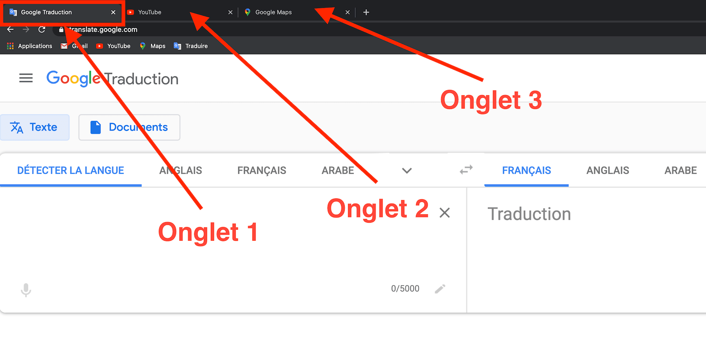
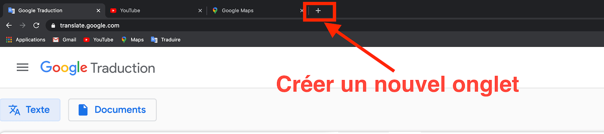
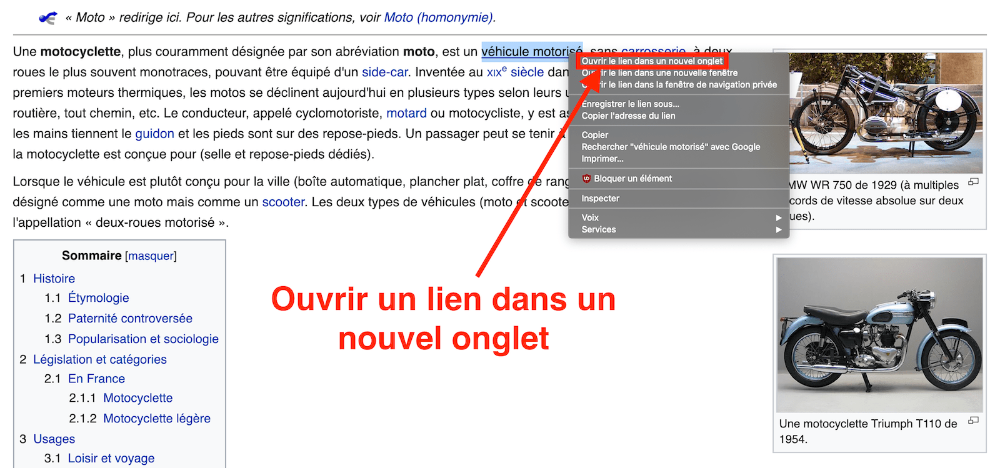
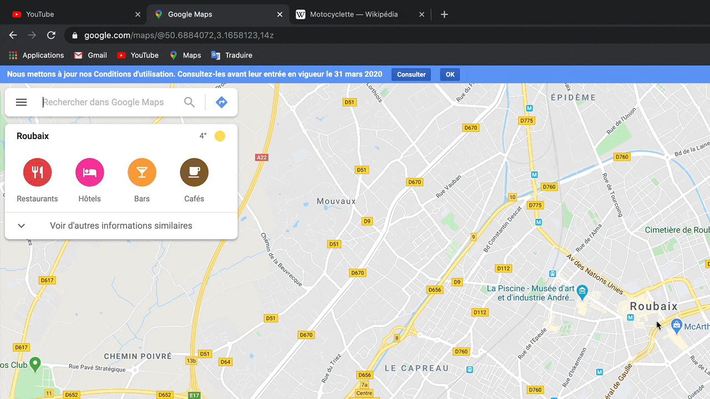

# Les onglets dans le navigateur

# Table des matières

  * [Qu'est-ce qu'un onglet ?](#qu-est-ce-qu-un-onglet)
  * [Quelle est la différence entre une fenêtre et un onglet ?](#difference-entre-fenetre-et-onglet)
  * [Comment créer un nouvel onglet](#comment-creer-un-onglet)
  * [Comment déplacer un onglet](#comment-deplacer-un-onglet)
  * [Comment fermer/supprimer un onglet](#comment-fermer-supprimer-un-onglet)
  * [Comment épingler un onglet](#comment-epingler-un-onglet)

  

## <a name="qu-est-ce-qu-un-onglet">Qu'est-ce qu'un onglet ?</a>

Un onglet dans un navigateur est une petite ex-croissance qui représente une page. C'est une façon très astucieuse d'ouvrir plusieurs pages internet au sein d'une même fenêtre du navigateur.
Cela s'apparente au principe de feuilles (représentant les onglets) dans un classeur (représentant une fenêtre).

Dans l'image ci-dessous, nous pouvons voir 3 onglets ouverts dans une fenêtre du navigateur Google Chrome.

  

## <a name="difference-entre-fenetre-et-onglet">Quelle est la différence entre une fenêtre et un onglet ?</a>

Une fenêtre peut rassembler plusieurs onglets, et un onglet ne peut afficher qu'une seule page internet.
Si on reprend l'exemple ci-dessus, un classeur (représentant la fenêtre) peut accueillir plusieurs feuilles (représentant les onglets) et chaque feuille est une page internet.

  

### <a name="comment-creer-un-onglet">Comment créer un nouvel onglet ?</a>

La première méthode pour créer un nouvel onglet dans son navigateur, est de cliquer sur le `+` au dessus de la barre d'adresse (cf image ci-dessous).

La deuxième méthode, qui est également la plus rapide (celle à privilégier) consiste à utiliser un raccourci clavier pour cela : 

* Pour Windows et Linux : `Ctrl + T`
* Pour Mac : `Cmd + T`

Il est également possible d'ouvrir un lien hypertexte présent dans une page directement dans un nouvel onglet. Pour cela il faut faire un `clic droit` sur le lien en question puis `clic gauche` sur `ouvrir le lien dans un nouvel onglet` (cf image ci-dessous).

  

## <a name="comment-deplacer-un-onglet">Comment déplacer un onglet ?</a>

Pour déplacer un onglet il suffit de faire un `glisser/déposer` (clic gauche maintenu, puis déplacer à gauche ou à droite, et enfin lâcher) sur l'onglet en question (cf l'image gif ci-dessous).

  

## <a name="comment-fermer-supprimer-un-onglet">Comment fermer/supprimer un onglet ?</a>

La première méthode pour fermer ou supprimer un onglet, il suffit de cliquer sur la petite croix à droite de l'onglet (cf l'image ci-dessous).

La seconde méthode la plus rapide et recommandée est d'utiliser le raccourci clavier :

* Pour Windows et Linux : `Ctrl + w`
* Pour Mac : `Cmd + w`

⚠️  Lorsqu'on ferme une fenêtre, tous les onglets ouverts sont fermés par la même occasion.

  

## <a name="comment-epingler-un-onglet">Comment épingler un onglet ?</a>

Épingler un onglet consiste à l'attacher avec la fenêtre du navigateur ouverte. Lorsqu'on l'épingle son affichage change et devient un petit onglet sans texte avec le symbole du site web.

Cela aura pour effet d'ouvrir automatiquement ces onglets à chaque ouverture du navigateur. Très pratique pour garder sous la main les sites qu'on visite régulièrement.

